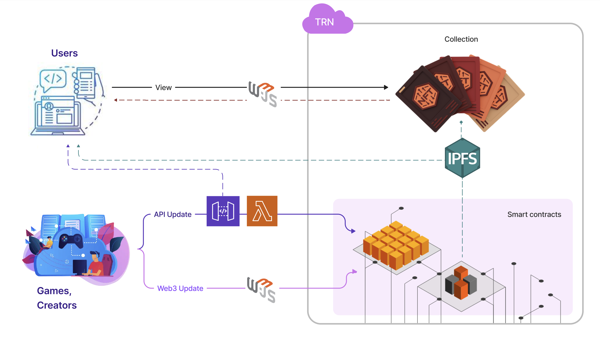
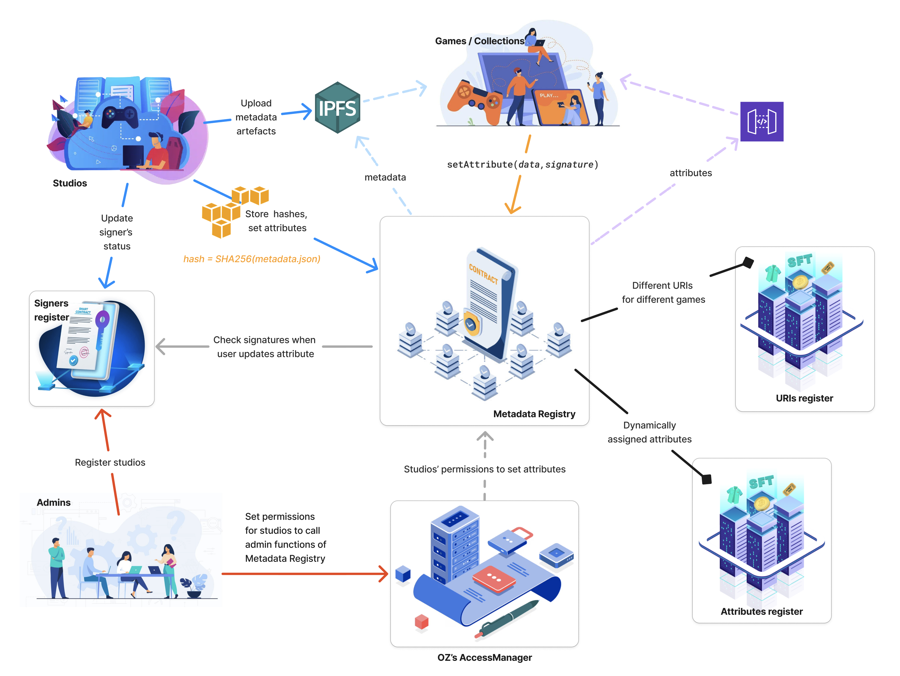

# Metadata Registry

this project has been developed for a Substrate based blockchain that has EVM support. It also can be deployed to Ethereum directly, but may require some gas optimizations.

# Problem statement

All existing NFT/SFT collections have metadata (attributes) set for their tokens, in accordance with the relevant standard (721/1155/…), such as "Eye color," "Background," and others.

Progressing in Web3 games often requires updating token attributes. However, such attributes are immutable by design or not decentralized, e.g., stored on web servers, which undermines the core idea of Web3.
We must find a way to update token attributes without compromising decentralization.

# Goals

Develop an approach for game studios to add new metadata to existing collections, while adhering to the following conditions:

• No middleman is required to verify the data change

• Data availability is permanent

It is also crucial that the solution can work with both types of pre-minted collections: those for which the metadata URI can be changed, and those to which access is unavailable.

# Proposed solution

A metadata registry, likely comprising a combination of backend APIs, Web3 interfaces (out of scope), and blockchain data.

# Requirements

### Access management requirements

Studios/creators can:

- Use any of the available attributes
- Add or change their own attributes only
- Manage admin accounts permitted to set attributes for owned tokens

### Online and offline updates

Offline updates must be signed by attribute admins.

### Gas costs

We should implement a two-pronged approach to pay for attribute updates:

- By token owner, to shift the costs to the beneficiary of the change
- By author of changes, to enforce the degradation value changes

Both update types must be supported for any change, and the initiator may choose between them.

### Other

We want to use CIDv1 to store metadata on IPFS.

# Architecture

Basically, we will have 4 contracts.

- AttributeRegister - to manage attributes
- URIsRegister - to manage URIs
- SignersRegister - to manage Signers
- Metadata registry - to rule (call their functions) them all

### AttributeRegister

Every contract can have an unlimited number of attributes, each with a name and an approved signer.
Only the attribute's signer can set the attribute's value. Typically, a studio introduces attributes for its own game, while other studios have their own attributes.

Mappings:

- `attributeId` → `attributeDetails` (name, and signer of the attribute)
- `tokenId` → `attributeId[]` (list of token’s attributes)
- `contract` → `attributeId[]`(list of contract’s attributes)
- `tokenId` → `attributeId` → `value` (value of specific `token:attribute` pair)

### URIsRegister

Token can have multiple URIs, and to differentiate between them, we introduce `labels`. Labels are of type `bytes32` and used by creators to "mark" their URIs.

_Essentially, tokens can have multiple labels pointing to different URIs._

Game studios can have numerous labels and attach various metadata files to tokens by labels.
It is impossible to re-write the label or URI, but new labels can be created and attached.

We recommend to use `keccak256(StudioName, GameName)` to create labels.

Mappings:

- `contract` → `label[]`
- `tokenId` → `label` → `sha256hash`

### SignersRegister

Each studio can have an unlimited number of admins to add attributes, and each admin can set their own and only signer’s address.

Technically, there are no “studios” in the scope of Metatada Registry; only admins, and signers. Admins can be added/removed by admin. It can be worth of considering to add a proper admins management, by Studios themselves, later.

Any admin can temporarily pause signature checks by setting the signer's status to inactive (false), which means user-initiated attribute updates will be suspended.

Mappings:

- `account` → `signer`
- `signer` → `status`

### Metadata registry

Essentially, `MetadataRegistry.sol` is a wrapper for the URIs and Attributes registers, that checks all rights and permissions, by communicating with:

- `SignersRegisger` to verify users signatures,
- AccessManager to verify Studio’s permissions to update data in the registers.

It would be better to split both Attributes and URIs registers into two separate logic and storage contracts for improved upgradeability.

# Alternative solutions

### Substrate blockchains - Proxies

For existing Substrate collection we can deploy a new proxy contract that adds new attributes while using functionality from the original one. Data, on the other hand, can be pulled from blockchain storage directly.

There are disadvantages:

- It will NOT work with EVM contracts, as we can not guarantee the same contract structure for every deployment, which is required for proxy contracts.
- The different contract address may confuse users.

On the other hand, if we do so, why not to update SFT pallet and move all required functionality to precompiles level?

### Substrate blockchains - precompiles update

This approach works for Substrate native collections only. EVM contracts will not be able to take advantage of this.

### Ecosystem approaches

There are a few other ERC proposals about updatable metadata, like the one from Cyfrin, [https://www.cyfrin.io/blog/eip-3664-full-guide-to-nft-properties](https://www.cyfrin.io/blog/eip-3664-full-guide-to-nft-properties), which focuses more on dynamic properties. However, this proposal is not fully developed, has no implementation, and appears to be merely a starting point for considering dynamic attributes that can be attached or detached from tokens.

We use the same idea for attachable dynamic attributes in this RFC, but we have expanded it to provide infrastructure that supports multiple coexisting contracts.

Other proposals are mostly stagnant or require new deployments.

### Does this project require a migration?

Any NFT/SFT contract can be enhanced with dynamic attributes by:

- registering in the Registry
- pointing URI to IPFS
